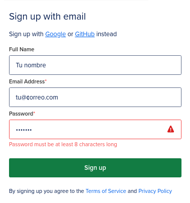
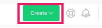
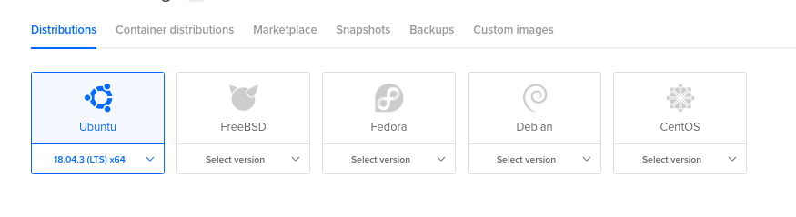
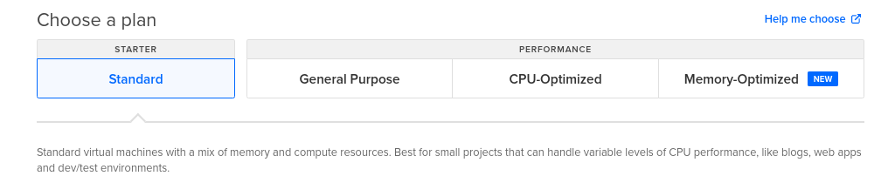
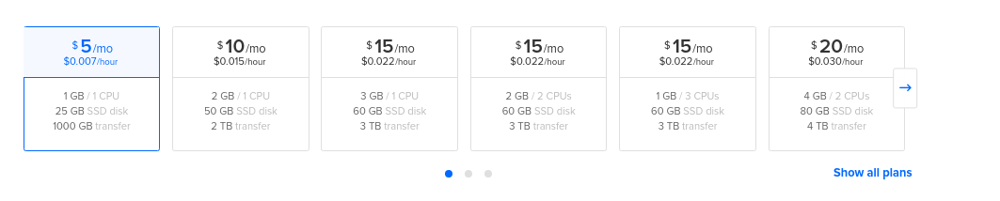
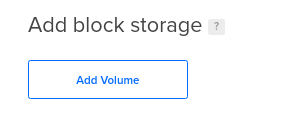
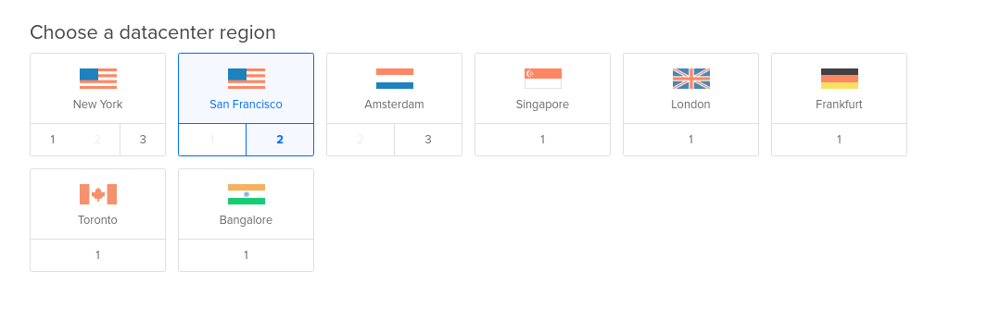
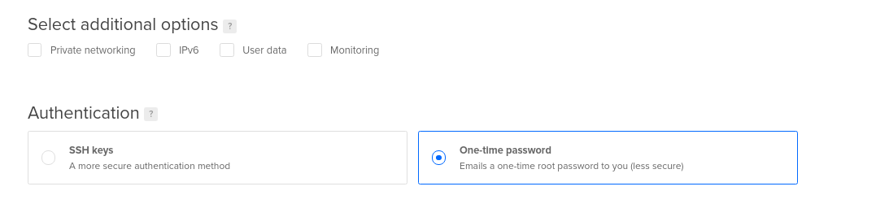

# Que es DigitalOcean ?  

DigitalOcean es un Cloud Hosting, un hosting en la nube. También puede definirse como un *IaaS*, una infraestructura como servicio.

Para implantar Digital Ocean como un ambiente de IaaS (Infraestructura como servicio), los desarrolladores lanzan una instancia privada de máquinas virtual (VM), que Digital Ocean llama *"Droplet"*. Los desarrolladores eligen el tamaño de la *"Droplet"*, la región geográfica y el data center donde se ejecutara.

En muy pocos segundos puedes disponer de un servidor accesible universalmente a través de una IP y un usuario root.

# Manos a la obra

Como primer paso creamos una cuenta en DO (Digital Ocean) y asociamos nuestra tarjeta de credito o debito.
[Link Digital Ocena](https://m.do.co/c/3971b566ed9b)


Ahora procedemos a crear nuestro primer VPS
En la parte superior derecha nos dirigimos al botón verde *create* y seleccionamos *Droplets*



## Sistema Operativo
A continuación se desplegara una nueva pantalla y en la primera parte debemos seleccionar el Sistema Operativo.


## Plan del Droplet

Dependiendo el uso que le demos seleccionamos el Plan, dependiendo el plan que seleccionemos nos desplegara opciones, si estas iniciando te recomiendo el *Standard*



## Caracteristicas de nuestro Droplet
A continuación debes seleccionar la memoria RAM, CPU, Transferencia mnensual que mas ase adapte a tus necesidades, si estas iniciando te recomiendo el de *5$/mensual*


## Block Storage
Los *Block Storage* son como las memorias flash, cuando ya no tengas espacio en tu VPS puedes aumentar el espacio usando *Block Storage*.


## Data Center
En esta parte seleccionamos la región donde estará nuestra VPS, algunas regiones no tienen por ahora *Block Storage*


## Authentication
En esta parte seleccionamos el método para ingresar a nuestro VPS, ya sea por *SSH key* o un password que se nos enviara al correo. 
<a href="/post/ctf-tools/" target="_blank">Que es SSH?</a>



## EOF
Con estos sencillos pasos ya tenemos nuestro VPS.


Para conectarte al VPS 
```=sh
ssh root@IP
```
Happy Coding :)