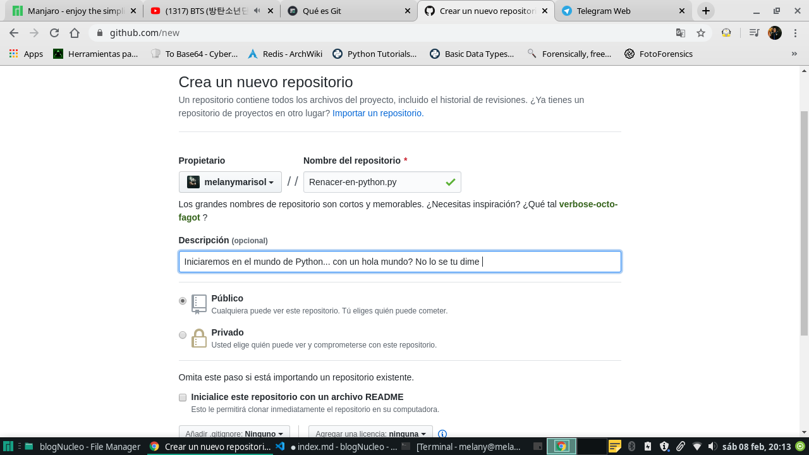
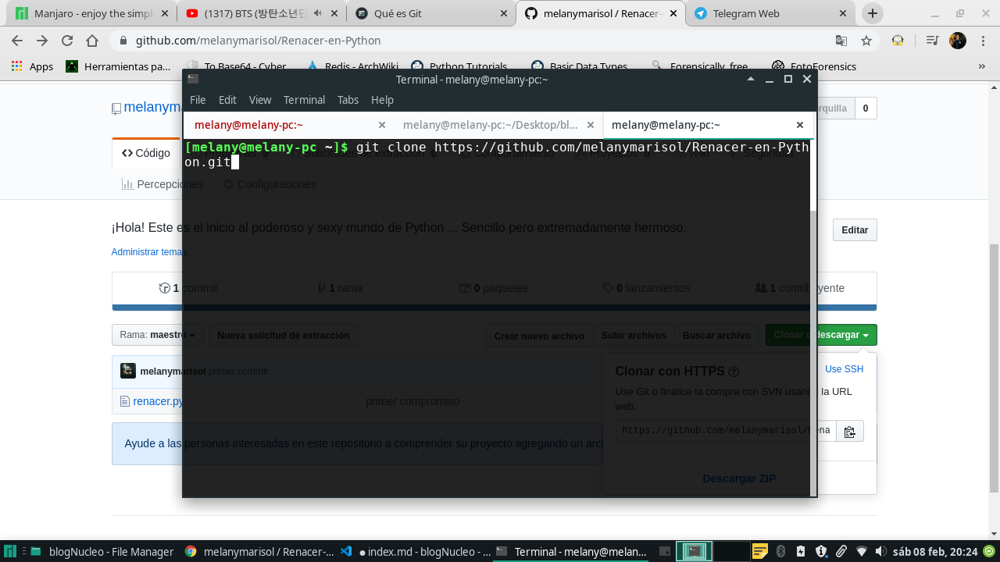
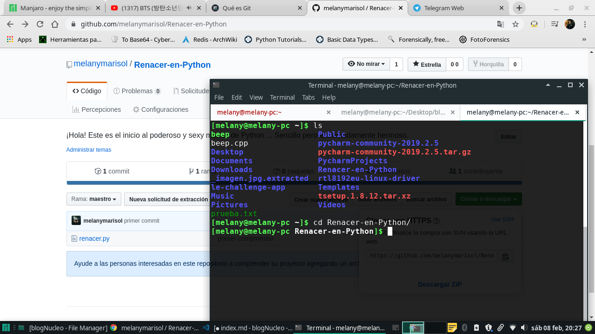
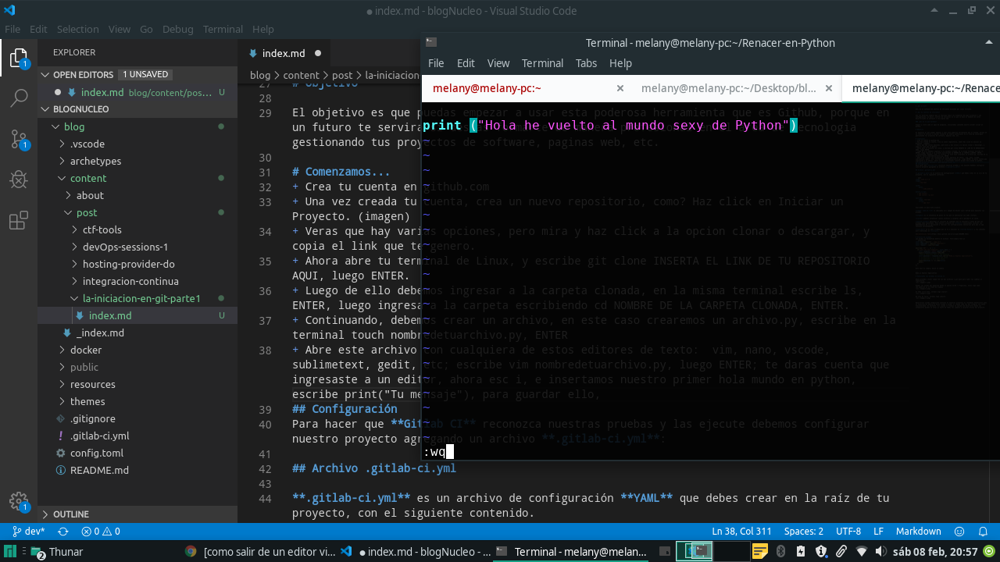
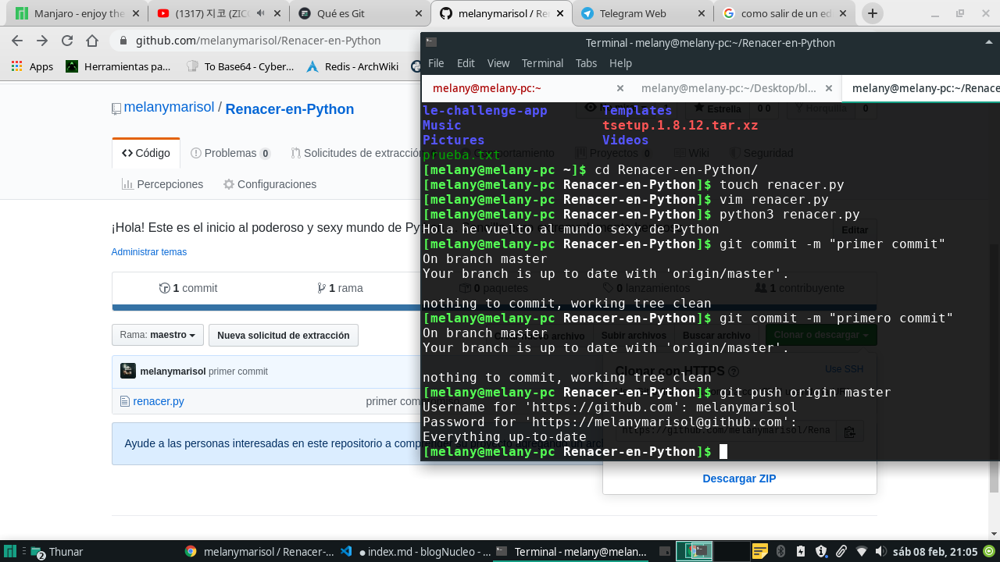

# ¿Qué es Git?

Git, es un software de control de versiones diseñado por Linus Torvalds. 

# ¿Qué es control de versiones? 

Son los diversos cambios que se realizan sobre los elementos de algún producto o una configuración, es decir, control de versiones es lo que se hace al momento de estar desarrollando un software o una página web.

### ¿Qué es lo que haremos? 

Simple y claro como el agua de pinguino, iniciaremos subiendo nuestro primer script en github.

# Objetivo

El objetivo es que puedas empezar a usar esta poderosa herramienta que es Github, porque en un futuro te servira si deseas formarte de manera profesional en el area de tecnologia gestionando tus proyectos de software, paginas web, etc. 

# Comenzamos...
+ Crea tu cuenta en github.com

+ Una vez creada tu cuenta, crea un nuevo repositorio, como? Haz click en Iniciar un Proyecto. 

+ Veras que hay varias opciones, pero mira y haz click a la opcion clonar o descargar, y copia el link que te genero.

+ Ahora abre tu terminal de Linux, y escribe git clone INSERTA EL LINK DE TU REPOSITORIO AQUI, luego ENTER.

+ Luego de ello debemos ingresar a la carpeta clonada, en la misma terminal escribe ls, ENTER, luego ingresa a la carpeta escribiendo cd NOMBRE DE LA CARPETA CLONADA, ENTER.

+ Continuando, debemos crear un archivo, en este caso crearemos un archivo.py, escribe en la terminal touch nombredetuarchivo.py, ENTER

+ Abre este archivo con cualquiera de estos editores de texto:  vim, nano, vscode, sublimetext, gedit, etc; escribe vim nombredetuarchivo.py, luego ENTER; te daras cuenta que ingresaste a un editor, ahora esc i, e insertamos nuestro primer hola mundo en python, escribe print("Tu mensaje"), para guardar ello escribe :wq, ENTER.

+ Te daras cuenta que volviste a la terminal, ahora escribe python3 nombredetuarchivo.py, y veras que despliega el mensaje que programaste.

+ Ya estamos a pocos pasos, escribe git commit -m "primer commit" y luego ENTER. Luego escribe git push origin master, ENTER, entonces te pedira tu usuario y password. Luego ENTER.

+ Listo! Ya lo hicimos, ahora ve nuevamente tu cuenta y mira la magia que hiciste. Espero te hayan servido los pasos. Ahora continua haciendo mas scripts, proyectos, paginas web, etc. Eres genial! 

Quiero agradecer a @luucamay y a @starsaminf por haberme ayudado a adentrarme y tener la curiosidad de empezar en este nuevo mundo! 
